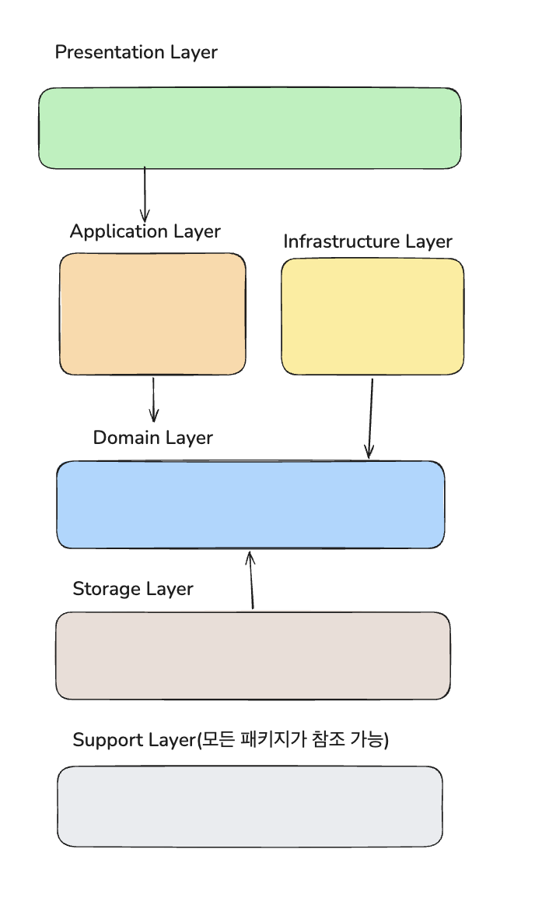

# spring-shopping

> 작성자: devfancy

관련 문서: [용어 사전 및 모델링](./docs/shopping-domain-modeling.md)

## 구현 전략
구현 과정에서 가장 중요하게 생각하는 원칙은 코드 품질, 가독성, 계층 간의 역할 분리입니다.

### 설계 원칙
- 요구사항을 최우선으로 해결하되, 오버엔지니어링을 지양하고 확장 가능한 구조를 설계한다.
- 기술 스택은 `build.gradle.kts`에 명시된 것을 기본으로 하며, 추가 라이브러리 도입 시 반드시 타당한 근거를 기록한다.
- 레이어드 아키텍처를 기반으로 회원, 상품, 위시 리스트 순으로 기능을 구현한다.
  - 레이어드 아키텍처를 기반으로 하지만, 추후 **멀티 모듈**을 고려하여 패키지를 구분한다.
  - api, domain, storage:db, infrastructure, support
- 단일 책임 원칙(SRP)에 따른 `Auth`와 `Member` 도메인의 분리는 추후 소셜 로그인이나 프로필 확장 시점으로 미루고,
  현재는 1:1 매핑 구조에 맞춰 단일 도메인 안에서 응집도 있게 설계한다.

#### 멀티 모듈 전환 시 패키지 -> 모듈 매핑 전략

현재는 단일 모듈이지만, 패키지 경계를 물리적으로 엄격히 구분하여 추후 모듈 분리 시 최소한의 변경으로 전환할 수 있도록 설계했습니다.

| 현재 패키지         | 분리 시 모듈                          |
|----------------|----------------------------------|
| api            | `:api`                           |
| application    | `:application`                   |
| domain         | `:domain` (순수 Kotlin, 외부 의존성 없음) |
| storage        | `:storage:db`                    |
| infrastructure | `:infrastructure`                |
| support        | `:support` (shared-kernel)       |

- `domain` 패키지는 JPA · Spring 의존성이 없어 분리 시 즉시 독립 모듈로 추출 가능합니다.
- `WishService`의 `ProductRepository` 직접 참조는 멀티 모듈 분리 시 도메인 이벤트 또는 ACL 패턴으로 전환이 필요한 지점입니다.

#### 패키지 의존성 방향

### 데이터 및 의존성 관리
- 레이어 간 결합도를 낮추기 위해 용도에 맞는 DTO를 사용한다.
  - Web 계층: `@@Request`, `@@Response` (클라이언트와의 규약)
  - Service 계층: `@@Command`, `@@Result `(비즈니스 로직의 입력과 결과)
- JPA Entity와 비즈니스 도메인 모델을 분리하여 관리한다. 
  - 도메인 모델은 순수 코틀린으로 작성하여 프레임워크 의존성을 제거한다.
  - 서비스 로직에서 Entity와 도메인 모델 간의 변환을 수행한다.
- 유효성 검사
  - 입력 데이터의 형식적인 유효성은 컨트롤러 계층의 전용 Validator가 담당한다.
  - 비즈니스 정책 및 제약사항 검증은 도메인 모델 내부에서 수행한다.
- 공통 응답 포맷
  - 모든 API 응답은 `ApiResponse<T>`로 래핑하여 반환한다.
  - 응답 구조는 `result`(성공 여부), `data`(실제 데이터), `error`(에러 상세)로 구성하여 클라이언트의 응답 처리 로직을 일관되게 유지한다.

### 서비스 계층 역할 분리
비즈니스 로직의 응집도를 높이고 파편화를 막기 위해 서비스의 역할을 두 가지로 엄격히 구분합니다.
- 응용 서비스 (Application Service): 트랜잭션 관리, 도메인 객체 조회/저장 등 비즈니스 유스케이스의 **실행 흐름 제어**만 담당합니다. 
  - 비즈니스 규칙이나 검증 로직을 직접 구현하지 않습니다.
- 도메인 서비스 (Domain Service): 단일 도메인 객체에 할당하기 어색하거나, 여러 도메인 객체가 협력해야 하는 **핵심 비즈니스 규칙 및 정책**을 전담합니다. 
  - 상태를 가지지 않으며 프레임워크에 의존하지 않는 순수 로직으로 구성합니다.

### 코드 품질 및 안정성
- BDD(Given-When-Then) 스타일로 작성하며, 핵심 비즈니스 로직에 대한 단위 테스트를 우선적으로 확보한다.
- 외부 연동과 관련하여 PurgoMalum API 호출 시 발생할 수 있는 타임아웃, 네트워크 오류 등 예외 상황에 대해 견고한 Fallback 또는 예외 처리를 구현한다.
- 장애 격리 및 회복력
  - 외부 비속어 필터링 API 연동 시 `Resilience4j` 서킷 브레이커를 적용한다.
  - 외부 서비스 장애가 우리 시스템으로 전파되는 것을 차단하고, 서킷이 열린 상태에서는 즉시 Fallback 처리를 수행한다.
  - 타임아웃은 3초로 설정하여 스레드 차단을 최소화한다.

---

## 구현해야 할 기능 목록

### 회원 API

- [x] 회원 가입
- [x] 로그인

### 상품 API

- [x] 상품 생성
- [x] 상품 조회
- [x] 상품 수정
- [x] 상품 삭제
- [x] 상품 목록 조회

### 위시 리스트 API

- [x] 위시 리스트 상품 추가
- [x] 위시 리스트 상품 삭제
- [x] 위시 리스트 상품 조회

## AI 도구 활용 및 학습 내용
본 과제를 진행하며 다음과 같은 방식으로 AI 도구를 활용하고 학습했습니다.
- 활용 방식: 정규식 작성, 비슷한 기능 구현(CRUD) 및 정책을 준수한 코드 리팩터링을 위해 CLAUDE 도구를 활용하여 개발 생산성을 극대화했습니다.
- 학습 내용: AI가 제안한 코드를 그대로 수용하지 않고, 아키텍처 원칙(계층 역할 분리, VO 도입 여부 판단, 테스트 코드 등)에 맞게 직접 검토하고 수정하는 과정에서 설계 판단력을 키웠습니다.

## 마무리 및 소감

