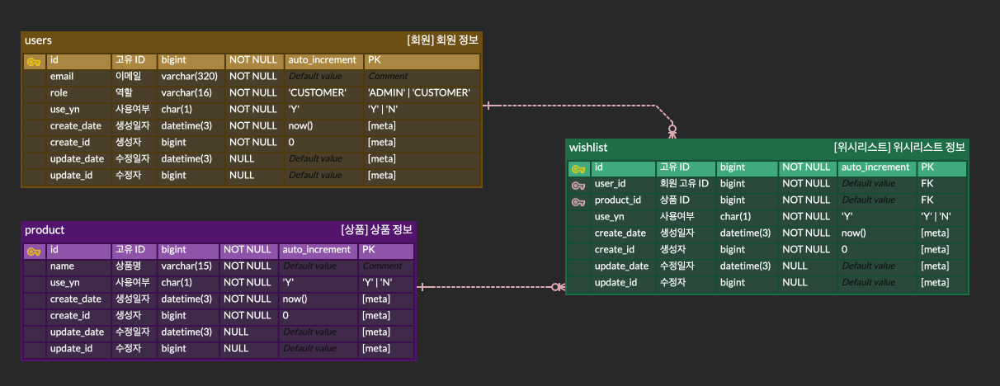

# 온라인 쇼핑몰 구현 과제 

## ERD

- erd cloud : https://www.erdcloud.com/d/7vnuP9tbqo85etrxx

## 📈 1. 과제 진행 요구 사항
- ✅ 쇼핑 저장소를 포크하고 클론하는 방식으로 시작
- ✅ 기능 구현 전 `README.md`에 구현 목록을 작성하고, 구현 전략을 정리
- [ ] Git 커밋 단위는 `README.md`에 정리하여 기능 목록 단위로 구성
    - [ ] AngularJS Git Commit Message Conventions을 참고하여 커밋 메세지 작성
- [ ] AI 도구 활용 시, `README.md`에 활용한 방식과 무엇을 학습하였는지 기록

## 2. 기능 요구 사항

### 공통 사항
- [ ] API 응답을 OAS 형식의 Springdoc으로 확인할 수 있다.
- ✅ RFC 7807 실패 응답을 일관되게 내려 준다.
- [ ] 삭제 정책은 소프트 DELETE이다.

### 2-1. 회원
- ✅ 회원은 `관리자`와 `고객`으로 나뉜다.
- ✅ 인증 처리는 `Spring Security`를 이용해 구현한다.
- ✅ 인증 토큰은 `JWT` 방식으로 구현한다.
- [ ] 발급 받은 토큰은  `Authorization`에 `accessToken`을 담아 요청한다.

#### - 이메일 규약
- [ ] RFC2821에 따라 최대 길이는 320자 까지 가능하다.
    - [ ] 로컬 파트 64자
    - [ ] 도메인 파트는 255자

#### - 비밀번호 규약
- [ ] NIST 비밀번호 가이드라인에 따라 최소 8자 이상부터 100자 미만까지 입력 가능하다.

#### 1) 회원 가입 ([POST] `/api/members/register`)
- ✅ 이메일과 비밀번호를 입력 받는다.
  - ✅ 이메일은 필수 값이다.
  - ✅ 비밀번호는 필수 값이다.
- ✅ 동일 이메일로는 회원 가입이 불가능하다.
- ✅ 회원 가입 성공 시, ResponseBody에 `accessToken`로 포함하여 내려준다.

#### 2) 로그인 ([POST] `/api/members/login`)
- ✅ 이메일과 비밀번호를 입력 받는다.
    - ✅ 이메일은 필수 값이다.
    - ✅ 비밀번호는 필수 값이다.
- ✅ 존재하지 않는 이메일의 경우 로그인에 실패한다.
- ✅ 비밀번호가 일치하지 않은 경우 로그인에 실패한다.
- ✅ 로그인 성공 시, ResponseBody에 `accessToken`로 포함하여 내려준다.

### 2-1. 상품
#### - 상품 규약
- [ ] 이름, 가격, 이미지 URL로 구성되어 있다.
- [ ] 상품은 고유 ID로 관리 된다.
    - [ ] `productId` 으로 관리 된다.
    - [ ] 숫자로 구성 되어 있다.

#### 1) 상품 등록 ([POST] `/api/products`)
- [ ] `관리자`는 상품을 등록할 수 있다.
- 상품 이름은
  - [ ] 공백 포함 15자까지 입력할 수 있다.
  - [ ] 특수 문자 `(, ), [, ], &, -, +, /, _`만 가능하다.
  - [ ] 비속어가 포함될 수 없다.
      - [ ] PurgoMalum API를 이용해 비속어 검증을한다.
  - [ ] 중복이 가능하다.
- 기본적으로 사용 여부는 활성화가 된다.
- [ ] 등록 성공 시, 해당 상품의 상세 정보를 조회할 수 있는 URI을 응답한다.

#### 2) 상품 조회 ([GET] `/api/products/{productId}`)
- ✅ `관리자`, `고객`은 상품을 조회할 수 있다.
- ✅ 사용 여부가 활성화 되어 있는 상품만 조회가 가능하다.
- ✅ `productId`을 이용해 특정 상품의 정보를 조회한다.
  - ✅ `productId` 값은 필수 값이다.
- ✅ 유효하지 않은 `productId`를 입력한 경우 오류 응답을 출력한다.
- ✅ 조회 성공 시, `productId`와 이름, 가격, 이미지 URL을 출력한다.

#### 3) 상품 수정 ([PUT] `/api/products/{productId}`)
- [ ] `관리자`는 본인이 등록한 상품에 한 해서 수정이 가능하다.
- [ ] 사용 여부가 활성화 되어 있는 상품만 수정이 가능하다.
- [ ] `productId`을 이용해 특정 상품을 수정한다.
  - [ ] `productId` 값은 필수 값이다.
- [ ] 유효하지 않은 `productId`를 입력한 경우 오류 응답을 출력한다.
- [ ] 수정 성공 시, 해당 상품의 상세 정보를 조회할 수 있는 URI을 응답한다.

#### 4) 상품 삭제 ([DELETE] `/api/products/{productId}`)
- [ ] `관리자`는 본인이 등록한 상품에 한 해서 삭제가 가능하다.
- [ ] 사용 여부가 활성화 되어 있는 상품만 삭제가 가능하다.
- [ ] `productId`을 이용해 특정 상품을 수정한다.
    - [ ] `productId` 값은 필수 값이다.
- [ ] 삭제시, 소프트 DELETE를 하여 사용 여부가 비활성화 된다.
- [ ] 유효하지 않은 `productId`를 입력한 경우 오류 응답을 출력한다.

#### 5) 상품 목록 조회 ([GET] `/api/products`)
- [ ] `관리자`, `고객`은 상품 목록을 조회할 수 있다.
- [ ] 사용 여부가 활성화 되어 있는 상품만 조회가 가능하다.
- [ ] 조회 성공 시, `productId`와 이름, 가격, 이미지 URL 리스트를 출력한다.

### 2-3. 위시 리스트

#### 1) 위시 리스트 상품 추가 ([POST] `/api/wishes`)
- [ ] `고객`은 등록된 상품을 위시 리스트에 추가할 수 있다.
- [ ] 상품의 경우
  - `productId`가 유효한 상품만 등록이 가능하다.
  - 한 번에 여러개의 `productId`를 이용해 등록이 가능하다.
  - 사용 여부가 활성화 되어 있는 상품만 등록이 가능하다.
  - 중복으로 추가될 경우, 이미 등록 된 상품으로 오류 응답을 출력한다.
- [ ] 기본적으로 사용 여부는 활성화가 된다.
- 응답의 경우
  - [ ] summary 값을 내려준다.
    - [ ] 전체 요청 건, 성공 건, 실패 건 등에 대한 count 값을 출력한다.
  - [ ] 각 상품 처리 결과 값을 내려준다.
    - [ ] 상태(`SUCCEEDED` | `FAILED`)로 구분한다.
    - [ ] 실패 시, 상세 메세지를 출력한다.
    - [ ] 성공 시, `wishId`를 출력한다.
      - [ ] `wishId`는 숫자로 구성되어 있다.

#### 2) 위시 리스트 상품 삭제 ([DELETE] `/api/wishes/{wishId}`)
- [ ] `고객`은 위시 리스트에 등록된 상품을 삭제할 수 있다.
- [ ] `wishId`는 필수 값이다.
- [ ] 유효한 `wishId`만 삭제가 가능하다.
  - [ ] 유효하지 않은 경우 오류 응답을 출력한다.
- [ ] 삭세시, 소프트 DELETE를 하여 사용 여부가 비활성화 된다.

#### 3) 위시 리스트 상품 조회 ([GET] `/api/wishes`)
- [ ] `고객`은 위시 리스트에 등록한 상품 리스트를 조회할 수 있다.
- [ ] 위시 리스트가 비어있는 경우에는 빈 리스트를 출력한다.
- [ ] 조회 성공 시, `wishId`와 상품 정보를 출력한다.

# 프로그래밍 요구 사항
- ✅ `Google Java Style Guide` 원칙으로 컨벤션을 지켜 프로그래밍한다.
  - ✅ 들여쓰기는 `4 spaces`로 한다.
- [ ] 들여쓰기 단계는 최대 2까지만 가능하다.
- [ ] 메서드 길이는 최대 15줄까지 가능하다.
- [ ] `else` 또는 `switch`  키워드를 사용하지 않는다.
- [ ] `3항 연산자`를 사용하지 않는다.
- [ ] 테스트 코드를 작성한다.