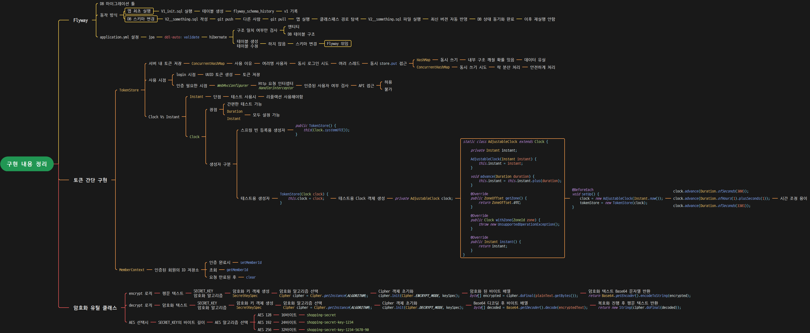

# spring-shopping

## 구현 전략

1. 도메인 객체, 컨트롤러, API 명세를 먼저 작성한다.
2. 기능 구현에 필요한 요소를 하나씩 추가하며, 구현과 동시에 테스트 코드를 작성한다.
3. 처음에는 외부 의존 없이 요구사항을 만족하는 코드만 작성한다.
4. 기본 구현이 완료되면 외부 라이브러리가 필요한 기능을 추가한다.
5. 모든 요구사항 구현 후 고도화 또는 리팩토링을 진행한다.

## API 명세

### Member

| URL | HTTP 메서드 | 기능 | 설명 |
|---|---|---|---|
| /api/member/sign-up | POST | 회원가입 | 이메일, 비밀번호, 이름으로 회원을 등록한다 |
| /api/member/login | POST | 로그인 | 이메일과 비밀번호로 인증 후 Authorization 토큰을 반환한다 |

### Product

| URL | HTTP 메서드 | 기능 | 설명 |
|---|---|---|---|
| /api/product/add | POST | 상품 추가 | 상품명, 가격, 이미지 URL로 상품을 등록한다 |
| /api/product/{id} | GET | 상품 단건 조회 | ID로 특정 상품 정보를 조회한다 |
| /api/product/list | GET | 상품 목록 조회 | 전체 상품 목록을 조회한다 |
| /api/product/update | PUT | 상품 수정 | 상품명, 가격, 이미지 URL을 수정한다 |
| /api/product/delete | GET | 상품 삭제 | ID로 특정 상품을 삭제한다 |

### Wish

| URL | HTTP 메서드 | 기능 | 설명 |
|---|---|---|---|
| /api/wish/list | GET | 위시리스트 조회 | 인증된 회원의 위시리스트를 조회한다 |
| /api/wish/add | GET | 위시리스트 추가 | 상품 ID로 위시리스트에 상품을 추가한다 |
| /api/wish/delete | DELETE | 위시리스트 삭제 | 위시 ID로 위시리스트에서 상품을 삭제한다 |

## AI 활용 전략

Claude Code 활용을 기본으로 한다.

- AI가 작성한 코드 중 개발자가 예상하지 못한 코드는 accept하지 않는다.
- 단, 개발자가 파악하지 못한 요구사항이나 오류를 잡아주는 코드는 예외적으로 accept한다.
- AI 추천 코드의 흐름을 이해하지 못한다면, 이해할 수 있는 형태로 개발자가 직접 재작성한다.
- 모르는 기능을 사용할 경우, 해당 기능의 동작 방식과 메서드 흐름을 문서에 기록한다.

잘 안보일 경우 새 탭에서 이미지 열기 클릭
