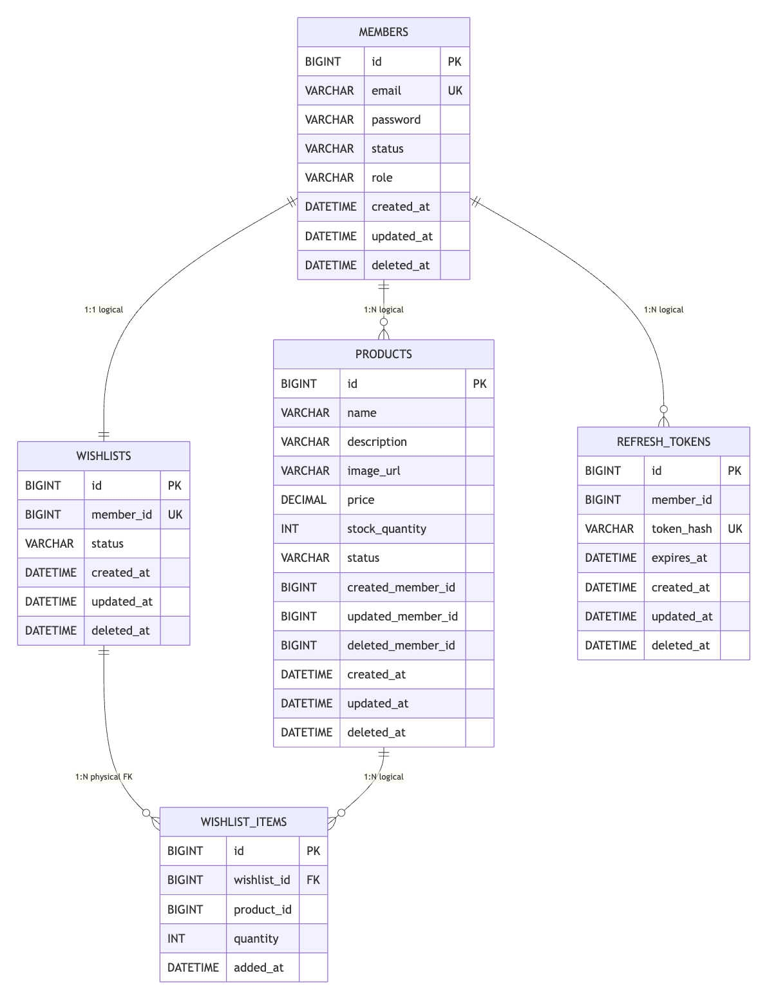

# 프로젝트 구조와 데이터 모델

이 문서는 리뷰어가 프로젝트 구조와 데이터 모델을 빠르게 파악할 수 있도록 정리한 문서입니다.

## 프로젝트 디렉토리

```text
.
├── README.md
├── docs
│   ├── architecture.md
│   ├── features.md
│   └── note.md
├── src
│   ├── e2eTest
│   │   ├── java/shopping/e2e
│   │   └── resources
│   ├── main
│   │   ├── java/shopping
│   │   │   ├── auth
│   │   │   ├── common
│   │   │   ├── member
│   │   │   ├── product
│   │   │   └── wish
│   │   └── resources
│   └── test
│       └── java/shopping
└── build.gradle.kts
```

## 소스 구조

`src/main/java/shopping`은 기능 기준 패키지로 나눴습니다. 각 기능 내부는 `adapter/in/api / adapter/in/web / domain / service / port/out / adapter/out` 역할로 구분합니다.

| 패키지 | 역할 | 주요 내용 |
| --- | --- | --- |
| `auth` | 인증 | JWT 발급, refresh token 회전, 접근 정책, 인터셉터 |
| `member` | 회원 | 회원 가입, 로그인, 회원 상태와 역할 규칙 |
| `product` | 상품 | 상품 CRUD, 값 객체 기반 입력 검증, Slang 검사 |
| `wish` | 위시리스트 | 위시 생성, 조회, 삭제, 중복 방지 |
| `common` | 공통 | 예외, 에러 코드, 공통 응답, 베이스 엔티티 |

테스트 코드는 목적별로 분리했습니다.

| 경로 | 목적 |
| --- | --- |
| `src/test/java` | 단위 테스트, 도메인 테스트, 컨트롤러 테스트 |
| `src/e2eTest/java` | 애플리케이션을 실제로 띄운 뒤 HTTP로 검증하는 E2E 테스트 |

## ERD



## 엔티티 관계

### 물리 관계

JPA 연관관계와 FK로 직접 연결한 관계는 아래 하나입니다.

- `wishlist_items.wishlist_id -> wishlists.id`

`WishlistItem`은 `Wishlist`를 `@ManyToOne`으로 참조합니다. 위시 아이템은 반드시 하나의 위시리스트에 속합니다.

### 논리 관계

도메인 경계를 단순하게 유지하기 위해 일부 관계는 FK 대신 ID 값으로만 연결했습니다.

| 관계 | 저장 방식 | 의미 |
| --- | --- | --- |
| `members` - `products` | `products.created_member_id` | 판매자와 상품의 소유 관계입니다. |
| `members` - `wishlists` | `wishlists.member_id` | 회원당 하나의 위시리스트를 가집니다. |
| `members` - `refresh_tokens` | `refresh_tokens.member_id` | 회원의 refresh token 발급 이력을 관리합니다. |
| `products` - `wishlist_items` | `wishlist_items.product_id` | 위시 아이템이 어떤 상품을 가리키는지 식별합니다. |

이 구조는 다른 도메인의 엔티티를 직접 끌어오지 않고도 식별자 기준으로 협력할 수 있게 합니다.

## 엔티티별 정리

### Member

- 테이블: `members`
- 역할: 회원 계정과 권한 상태를 관리합니다.
- 핵심 속성: `email`, `password`, `status`, `role`
- 핵심 규칙:
  - `ACTIVE` 상태만 로그인과 접근이 가능합니다.
  - `SELLER` 역할만 상품 CRUD가 가능합니다.

### Product

- 테이블: `products`
- 역할: 판매자가 등록한 상품을 관리합니다.
- 핵심 속성: `name`, `description`, `imageUrl`, `price`, `status`, `createdMemberId`
- 핵심 규칙:
  - 상품 소유자만 수정과 삭제가 가능합니다.
  - 이름, 가격, 이미지 URL 규칙은 값 객체에서 검증합니다.
  - 삭제는 `DELETED` 상태와 삭제 시각을 남기는 소프트 삭제 방식입니다.

### Wishlist

- 테이블: `wishlists`
- 역할: 회원 단위 위시리스트 루트를 관리합니다.
- 핵심 속성: `memberId`, `status`
- 핵심 규칙:
  - 회원당 하나의 위시리스트만 허용합니다.
  - 삭제는 `DELETED` 상태와 삭제 시각을 남기는 소프트 삭제 방식입니다.

### WishlistItem

- 테이블: `wishlist_items`
- 역할: 위시리스트에 담긴 상품 항목을 관리합니다.
- 핵심 속성: `wishlist`, `productId`, `quantity`, `addedAt`
- 핵심 규칙:
  - 하나의 위시리스트에 같은 상품을 중복으로 추가할 수 없습니다.
  - 수량은 `WishQuantity` 값 객체 규칙을 따릅니다.

### RefreshToken

- 테이블: `refresh_tokens`
- 역할: 7일 로그인 유지와 refresh token 회전을 관리합니다.
- 핵심 속성: `memberId`, `tokenHash`, `expiresAt`
- 핵심 규칙:
  - 원문 token 대신 해시값만 저장합니다.
  - refresh 요청 시 token을 회전합니다.
  - 만료 시점이 지나면 사용할 수 없습니다.
