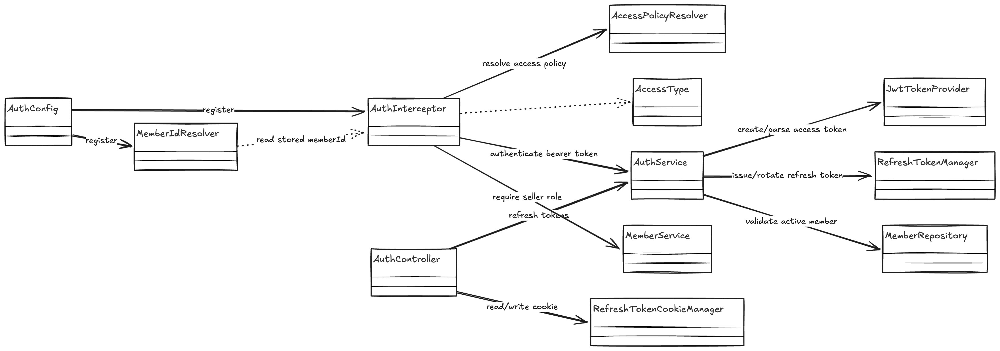
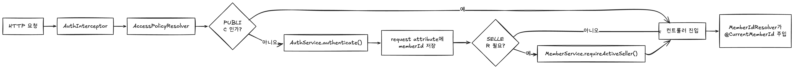
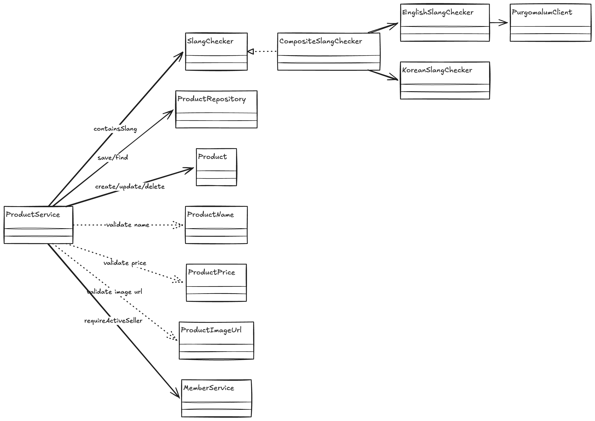
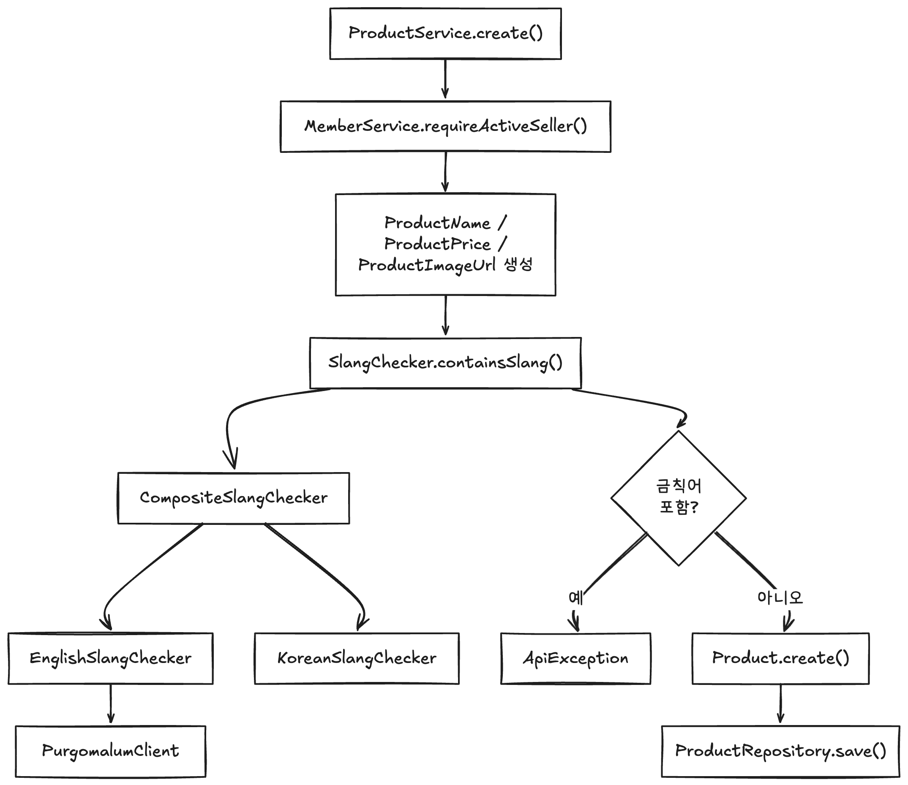
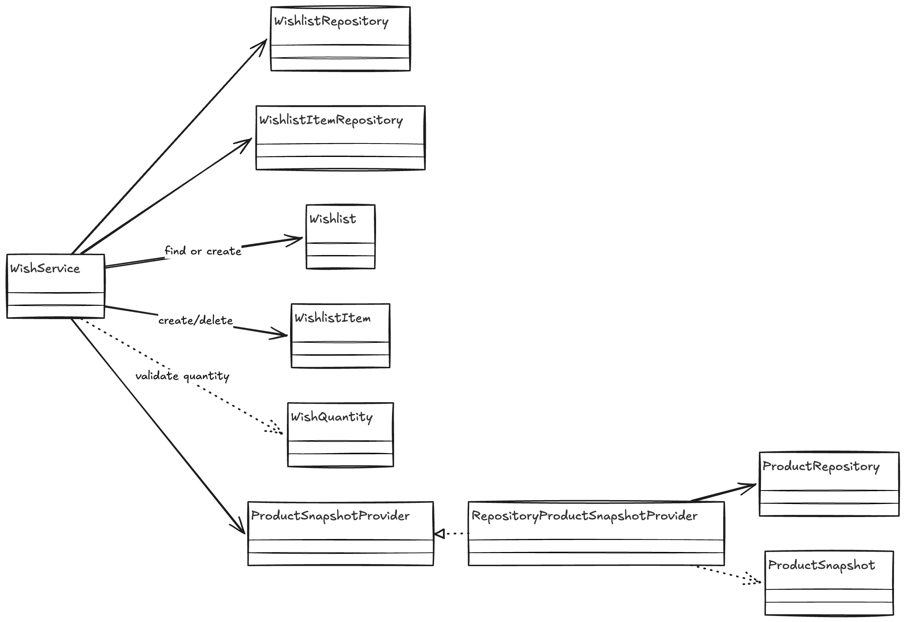

# 클래스 설계 문서

이 문서는 리뷰 전에 클래스 협력 구조를 빠르게 이해할 수 있도록 정리한 문서입니다.  
구현 세부사항보다 "어떤 클래스가 어떤 책임으로 연결되는가"를 설명합니다.

## 먼저 볼 포인트

- 인증/인가 흐름은 `Interceptor + Policy Resolver + Argument Resolver` 조합으로 구성했습니다.
- 상품 생성 검증은 `product/service` 아래에서 `SlangChecker` 인터페이스 뒤에 Composite 구조를 두어 언어별 검사기를 조합했습니다.
- 외부 HTTP와 읽기 스냅샷 제공처럼 프레임워크 의존성이 있는 구현은 `product/adapter/out`으로 분리하고, 서비스가 보는 추상화는 `product/port/out`에 뒀습니다.
- 위시리스트는 `Product` 엔티티를 직접 끌어오지 않고 `ProductSnapshotProvider`를 통해 읽기 전용 정보만 사용합니다.
- 도메인 규칙은 가능한 한 엔티티/값 객체 안에 두고, 서비스는 유스케이스 조합에 집중합니다.

## 1. 인증/인가 클래스 설계

### 핵심 의도

- 컨트롤러마다 인증 로직을 반복하지 않도록 웹 계층에서 공통 처리합니다.
- 엔드포인트 접근 수준은 어노테이션으로 선언하고, 실제 판정은 별도 Resolver가 담당합니다.
- 인증된 회원 ID는 request attribute에 저장한 뒤 `@CurrentMemberId`로 주입합니다.

### 클래스 다이어그램

### 요청 흐름

### 리뷰 포인트

- `AuthInterceptor`는 인증 실행과 권한 확인을 담당하고, 접근 수준 해석 자체는 `AccessPolicyResolver`로 분리되어 있습니다.
- `AccessPolicyResolver`는 메서드와 클래스 레벨 어노테이션을 함께 해석하므로 선언 위치가 바뀌어도 흐름이 유지됩니다.
- `MemberIdResolver`는 interceptor가 저장한 값을 읽기만 하므로, 인증 로직이 컨트롤러 시그니처까지 새지 않습니다.
- refresh token 재발급은 `AuthController -> AuthService -> RefreshTokenManager`로 흐르고, 쿠키 포맷 책임은 `RefreshTokenCookieManager`에 고정했습니다.

## 2. 상품 생성/수정 검증 클래스 설계

### 핵심 의도

- 상품 입력 규칙은 값 객체로 조기 검증합니다.
- 금칙어 검사는 인터페이스 뒤에 숨겨 서비스가 검사 방식 자체를 알지 않게 구성했습니다.
- 영어/한글 검사 로직을 분리해 규칙 변경 범위를 국소화했습니다.

### 클래스 다이어그램

### 패턴 관점 정리

- `SlangChecker`는 서비스가 의존하는 추상화입니다.
- `CompositeSlangChecker`는 영어/한글 검사기를 조합하는 Composite 역할입니다.
- `EnglishSlangChecker`, `KoreanSlangChecker`는 언어별 규칙을 캡슐화한 세부 전략처럼 동작합니다.
- `EnglishSlangVerificationPort`는 영어 비속어 외부 검증을 숨기는 outbound port입니다.
- `PurgomalumEnglishSlangAdapter`, `PurgomalumFeignClient`는 PurgoMalum 연동을 담당하는 outbound adapter입니다.
- `ProductName`, `ProductPrice`, `ProductImageUrl`은 값 객체로서 생성 시점에 유효성 검사를 강제합니다.

### 생성 시퀀스 요약

### 리뷰 포인트

- 서비스는 "검사한다"는 사실만 알고 있고, 영어/한글/외부 API 여부는 모릅니다.
- 금칙어 규칙을 추가할 때는 `CompositeSlangChecker`에 새 검사기를 연결하면 되므로 `ProductService` 수정 범위가 작습니다.
- 값 객체 도입으로 상품 규칙이 엔티티 외부 문자열 파라미터에 흩어지지 않습니다.

## 3. 위시리스트와 상품 스냅샷 협력

### 핵심 의도

- 위시리스트는 상품 도메인의 엔티티 전체를 소유하지 않고 상품 식별자와 읽기용 스냅샷만 사용합니다.
- 도메인 간 결합을 줄이기 위해 `ProductSnapshotProvider` 인터페이스를 둡니다.

### 클래스 다이어그램

### 협력 해설

- `WishService`는 상품 존재 여부와 응답용 정보를 `ProductSnapshotProvider`에 위임합니다.
- `RepositoryProductSnapshotProvider`는 현재 구현체이며, active 상품만 `ProductSnapshot`으로 변환합니다.
- 위시 도메인은 `productId`만 저장하므로 상품 엔티티 생명주기에 직접 묶이지 않습니다.
- 목록 조회에서 삭제된 상품은 `findActiveProduct()` 결과가 비어 응답에서 자연스럽게 제외됩니다.

### 리뷰 포인트

- 이 구조는 읽기 전용 참조 모델을 둔 형태라, 도메인 간 객체 그래프가 커지는 것을 막습니다.
- 추후 상품 조회 소스가 DB 외부 캐시나 다른 서비스로 바뀌어도 `WishService`는 인터페이스만 유지하면 됩니다.

## 4. 도메인 객체 배치 기준

| 구분 | 클래스 | 역할 |
| --- | --- | --- |
| 엔티티 | `Member`, `Product`, `Wishlist`, `WishlistItem`, `RefreshToken` | 식별자를 가지며 상태 변화와 핵심 규칙을 가집니다. |
| 값 객체 | `ProductName`, `ProductPrice`, `ProductImageUrl`, `WishQuantity`, `JwtSubject` | 생성 시점 검증 또는 읽기 모델 표현을 담당합니다. |
| 애플리케이션 서비스 | `AuthService`, `ProductService`, `WishService`, `MemberService` | 여러 도메인 객체와 저장소를 조합해 유스케이스를 수행합니다. |
| 서비스 디렉토리 | `product/service` 아래 `ProductService`, `SlangChecker`, `CompositeSlangChecker`, `EnglishSlangChecker`, `KoreanSlangChecker` | 핵심 유스케이스와 검증 조합 로직을 모읍니다. |
| 아웃바운드 포트 | `product/port/out` 아래 `ProductSnapshotProvider`, `EnglishSlangVerificationPort` | 서비스가 외부 저장소나 외부 검증을 사용할 때 의존하는 추상화입니다. |
| 인프라/아웃바운드 어댑터 | `product/adapter/out` 아래 `RepositoryProductSnapshotProvider`, `PurgomalumEnglishSlangAdapter`, `PurgomalumFeignClient` | 저장소와 외부 HTTP 연결처럼 프레임워크/외부 시스템 접점을 캡슐화합니다. |
| 인바운드 API 어댑터 | `*/adapter/in/api` 아래 `AuthController`, `MemberController`, `ProductController`, `WishController`와 요청/응답 DTO | HTTP 요청/응답 바인딩과 API 계약을 담당합니다. |
| 인바운드 웹 어댑터 | `auth/adapter/in/web` 아래 `AuthInterceptor`, `MemberIdResolver`, `AccessPolicyResolver`, `RefreshTokenCookieManager` | 인증 정책, 현재 회원 주입, 쿠키 포맷 같은 웹 진입 인프라를 담당합니다. |

## 리뷰 시작 순서 제안

1. 인증/인가 다이어그램을 먼저 보고 `AuthInterceptor`, `AccessPolicyResolver`, `MemberIdResolver`를 읽습니다.
2. 그 다음 `AuthService`, `RefreshTokenManager`, `JwtTokenProvider`로 토큰 흐름을 확인합니다.
3. 상품 쪽은 `ProductService`부터 읽고 `SlangChecker` 계층과 값 객체들로 내려갑니다.
4. 마지막으로 `WishService`와 `ProductSnapshotProvider`를 보면 도메인 경계 의도가 보입니다.
